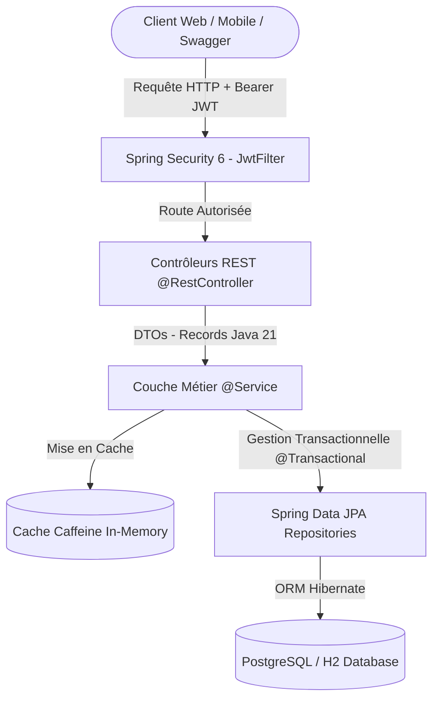

# 🛍️ NovaMarket API - E-Commerce REST Backend

[](https://openjdk.org/)
[](https://spring.io/projects/spring-boot)
[-blue.svg?style=flat&logo=springsecurity)](https://spring.io/projects/spring-security)
[](https://www.postgresql.org/)
[](https://junit.org/junit5/)
[](https://www.docker.com/)

**NovaMarket API** est une API RESTful d'entreprise haute performance pour le e-commerce, conçue avec les meilleures pratiques de l'écosystème **Java 21** et **Spring Boot 3**. 

L'architecture respecte les principes de la **Clean Architecture / Layered Architecture**, avec une sécurité sans état (*stateless*) via des jetons **JWT**, une gestion de cache en mémoire (**Caffeine**), des transactions ACID strictes pour les commandes et les stocks, et une documentation interactive **OpenAPI 3 / Swagger**.

---

## 🏛️ Architecture & Flux des Données



---

## ✨ Fonctionnalités Clés

- **Authentification & Autorisation (RBAC)** :
  - Architecture *Stateless* basée sur des tokens signés **JWT (HMAC-SHA256)**.
  - Hachage sécurisé des mots de passe avec **BCrypt** et sel aléatoire.
  - Rôles et permissions : `ROLE_CUSTOMER` (clients) et `ROLE_ADMIN` (administrateurs).
- **Catalogue & Produits** :
  - Pagination et tri dynamiques (`Pageable`, `Sort`).
  - Filtrage par catégorie et recherche textuelle insensible à la casse.
  - Cache haute performance avec **Caffeine** pour des temps de réponse sous la milliseconde (`@Cacheable`, `@CacheEvict`).
- **Panier d'Achat & Passage de Commande** :
  - Panier persistant avec recalcul des totaux en temps réel.
  - **Checkout transactionnel atomique (`@Transactional`)** : déduction des stocks avec détection des conflits de concurrence (*Race Conditions*), génération de numéro de commande unique (`ORD-XXXXX`), et figeage des prix unitaires (*Price Snapshotting*).
- **Gestion Centralisée des Exceptions** :
  - `@RestControllerAdvice` conforme au standard **RFC 7807 (Problem Details)** avec décomposition des erreurs de validation par champ.
- **Documentation Interactive & DevOps** :
  - **Swagger UI** avec bouton d'authentification Bearer token intégré.
  - Profils Spring configurables (`dev` avec H2 en mémoire, `prod` avec PostgreSQL).
  - Conteneurisation **Docker** via un *multi-stage build* et orchestration **docker-compose**.
  - Pipeline d'intégration continue **GitHub Actions** (`ci.yml`).

---

## 🚀 Démarrage Rapide

### Prérequis
- **JDK 21** ou supérieur
- **Maven 3.9+** (ou Docker si vous préférez lancer via conteneurs)

### 1. Lancement en Développement (Base H2 en mémoire pré-chargée)
Aucune base de données externe n'est requise. Les rôles, deux utilisateurs et 6 produits réels sont automatiquement injectés au démarrage :
```powershell
mvn spring-boot:run
```
L'API est immédiatement disponible sur `http://localhost:8080`.

- 📖 **Swagger UI** : [http://localhost:8080/swagger-ui/index.html](http://localhost:8080/swagger-ui/index.html)
- 🗄️ **Console Web H2** : [http://localhost:8080/h2-console](http://localhost:8080/h2-console)  
  *(JDBC URL: `jdbc:h2:mem:novamarket_dev` | User: `sa` | Password: vide)*

### 2. Lancement en Production avec Docker & PostgreSQL
Pour démarrer conjointement l'API Spring Boot, PostgreSQL 16 et pgAdmin :
```powershell
docker compose up --build
```
- API REST : [http://localhost:8080](http://localhost:8080)
- pgAdmin : [http://localhost:5050](http://localhost:5050) *(admin@novamarket.com / admin)*

---

## 🔑 Identifiants de Démonstration Pré-configurés

| Rôle | Email | Mot de passe | Permissions |
| :--- | :--- | :--- | :--- |
| **Administrateur** | `admin@novamarket.com` | `Admin123!` | Gestion catalogue (`POST /api/products`), consultation complète |
| **Client** | `client@novamarket.com` | `Client123!` | Panier d'achat, checkout, historique de commandes |

---

## 📋 Résumé des Principaux Endpoints REST

| Méthode | URI | Description | Accès |
| :--- | :--- | :--- | :--- |
| `GET` | `/api/health` | Vérification de l'état de santé du service | Public |
| `POST` | `/api/auth/register` | Inscription d'un nouveau client (BCrypt + JWT) | Public |
| `POST` | `/api/auth/login` | Connexion et obtention du jeton JWT Bearer | Public |
| `GET` | `/api/auth/me` | Consultation du profil de l'utilisateur connecté | Authentifié |
| `GET` | `/api/categories` | Liste de toutes les catégories (Mise en cache) | Public |
| `GET` | `/api/products` | Liste paginée des produits (`page`, `size`, `sort`) | Public |
| `GET` | `/api/products/{id}` | Fiche détaillée d'un produit (Mise en cache) | Public |
| `GET` | `/api/products/search?q=...` | Recherche textuelle de produits | Public |
| `POST` | `/api/products` | Création d'un produit (Validation `@Valid`) | **ADMIN** |
| `GET` | `/api/cart` | Consultation de son panier d'achat | Authentifié |
| `POST` | `/api/cart/items` | Ajout d'un article au panier | Authentifié |
| `PUT` | `/api/cart/items/{itemId}` | Modification de quantité d'un article | Authentifié |
| `DELETE` | `/api/cart/items/{itemId}` | Suppression d'un article du panier | Authentifié |
| `POST` | `/api/orders/checkout` | Validation de la commande (Transaction atomique) | Authentifié |
| `GET` | `/api/orders/my-orders` | Historique des commandes du client connecté | Authentifié |

---

## 🧪 Exécution des Tests Automatisés

Le projet comprend une suite complète de tests unitaires (JUnit 5 + Mockito) et d'intégration web (MockMvc) :
```powershell
mvn test
```
**Résultats :** 10 tests, 0 échec (100% de succès).

---

## 👨‍💻 Auteur & Licence
- Développé sous licence **Apache 2.0**.
